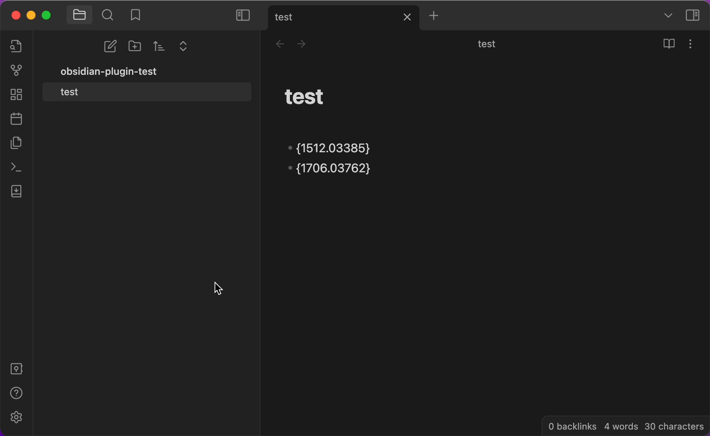
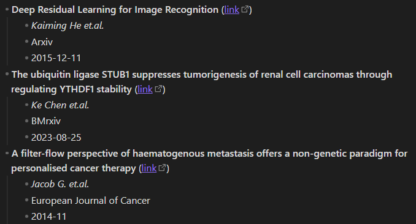
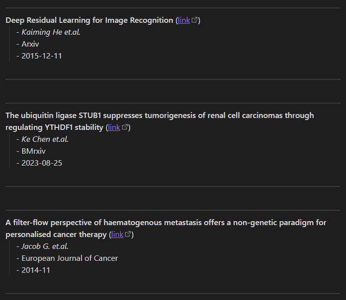

# Obsidian AutoLiterature

Obsidian plugin designed to assist you in taking notes for your literature. Adapted from this [repository](https://github.com/wilmerwang/autoLiterature).

这是一个 Obsidian 插件帮助你记录文献笔记。改编自 [repository](https://github.com/wilmerwang/autoLiterature).

Welcome any suggestions.

## How to use

Download from Obsidian community plugins:

- open settings
- turn on community plugins and browse plugins
- search `autoliterature` and install 

Download source code:

- clone this repo to the path: vault/.obsidian
- turn on community plugins in obsidian
- enable autoLiterature

## ScreenShot

This plugin supports arXiv ID，boi ID，medRXiv ID，BioRXiv ID.

This plugin will Auto-detection the string "- {xxx}".


When the note file includes "- {paper_id}", the information of that literature will replace.



## Settings

**Output format**: let you customize your paperInfo foramt. 
- ${title} will be replaced by paper's title
- ${url}, ${author}, ${journal}, ${pubDate} as the same
- \n means the new line, \t means the tab

>Note: different themes will have different effects

example1 (default setting):
```
- **${title}** ([link](${url}))\n\t- *${author} et.al.*\n\t- ${journal}\n\t- ${pubDate}
```



example2:
```
------\n**${title}** ([link](${url}))\n\t- *${author} et.al.*\n\t- ${journal}\n\t- ${pubDate}\n\n------\n
```


