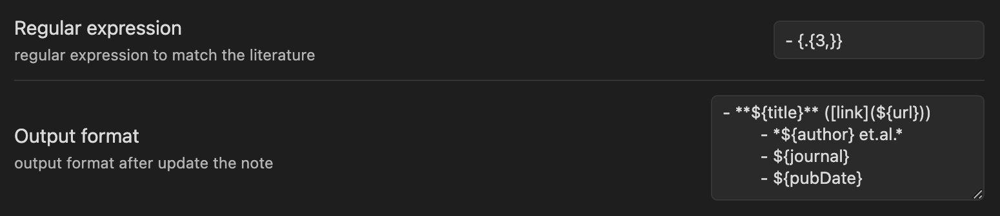
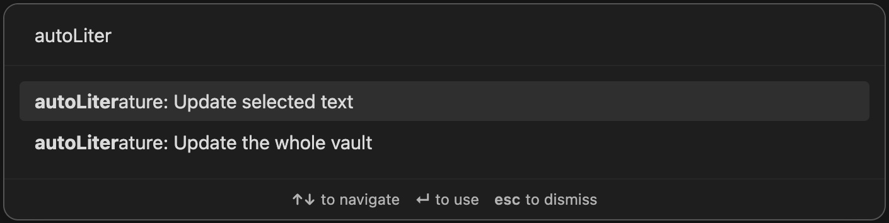

# Obsidian AutoLiterature

Obsidian plugin designed to assist you in taking notes for your literature. Adapted from this [repository](https://github.com/wilmerwang/autoLiterature).

这是一个 Obsidian 插件帮助你记录文献笔记。改编自 [repository](https://github.com/wilmerwang/autoLiterature).

Welcome any suggestions.

## Download

Download from Obsidian community plugins:

- open settings
- turn on community plugins and browse plugins
- search `autoliterature` and install 

Download source code:

- clone this repo to the path: vault/.obsidian
- turn on community plugins in obsidian
- enable autoLiterature

## ScreenShot


This plugin will fetch the info of paper according the paperID in your note, which supports arXiv ID，boi ID，medRXiv ID，BioRXiv ID.

By default, this plugin will Auto-detection the string "- {paperID}". 
When the note file includes "- {paper_id}", the information of that literature will replace.

## Settings



**Regular expression**: let you customize the detected string you want.

Regular expression's default vaule is "- \{.{3,}\}". This plugin to find the paperID in your note based on Regular expression. 

The plugin will then determine the category of paperID and fetch the article information. The regular expressions for different types of articles are as follows：
```
doi: /10\.(?!1101)[0-9]{4}\/.*/
medbiorxivId: /10\.1101\/.*/
arxivId: /(arXiv:)?[0-9]{2}[0-1][0-9]\.[0-9]{3,}.*|.*\/[0-9]{2}[0-1][0-9]{4}/
```

**Output format**: let you customize your paperInfo output foramt. 
- ${title} will be replaced by paper's title
- ${url}, ${author}, ${journal}, ${pubDate} as the same
- \n means the new line, \t means the tab

> Note: 
> 1. Different themes have different effects.
> 2. When you enter tab in a textArea in Obsidian setting, the default action is to switch focus. So if you want to use tab in the outputFormat, you can copy from any other text editor.

example1 (default setting):
```
- **${title}** ([link](${url}))
    - *${author} et.al.*
    - ${journal}
    - ${pubDate}
```


example2:
```
------
**${title}** *${author} et.al.* ${journal} ${pubDate} ([link](${url}))
```


## Command

The icon on the left side's action is to update the active Note you open.

You can also use the command to update the note.



**Command1**: Update selected text

1. Select text by your cursor
2. command/ctrl + p
3. select "Update selected text"

**Command2**: Update the whole vault

1. command/ctrl + p
2. select "Update the whole vault"