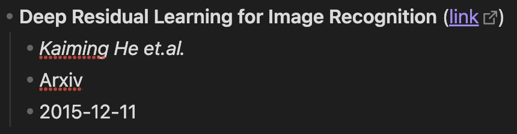

# Obsidian AutoLiterature

An Obsidian plugin that streamlines academic literature management by automatically fetching paper information and downloading PDFs. Adapted from this [repository](https://github.com/wilmerwang/autoLiterature).

这是一个 Obsidian 插件，通过自动获取论文信息和下载 PDF 来简化学术文献管理。改编自 [repository](https://github.com/wilmerwang/autoLiterature)。

## Features

- 🔍 **Automatic Paper Detection**: Detects paper IDs in your notes using customizable patterns
- 📝 **Rich Metadata Fetching**: Retrieves comprehensive paper information including title, authors, journal, and publication date
- 📥 **Smart PDF Management**: Automatically downloads and organizes PDF files with flexible naming and storage options
- 🎯 **Multiple ID Support**: Works with various paper identifiers:
  - arXiv ID (e.g., 2310.12567)
  - DOI (e.g., 10.1038/s41586-021-03819-2)
  - medRxiv/bioRxiv ID (e.g., 10.1101/2023.01.01.12345)

## Installation

### From Obsidian Community Plugins
1. Open Obsidian Settings
2. Navigate to Community Plugins and enable them
3. Search for "AutoLiterature" and click Install
4. Enable the plugin

### From Source Code
1. Clone this repository to your vault's `.obsidian/plugins` directory
2. Enable Community Plugins in Obsidian settings
3. Enable AutoLiterature

## Usage

### Basic Usage
1. Write a paper ID in your note using the pattern: `- {paperID}`
2. Click the AutoLiter icon in the left ribbon or use the command
3. The plugin will:
   - Replace the ID with formatted paper information
   - Download the PDF file (if enabled)

### Demo


## Configuration

### Literature Detection

**Regular Expression**
- Default: `- \{.{3,}\}`
- Customizable to match your note-taking style
- The plugin uses this pattern to find paper IDs in your notes

**Output Format**
- Customize how paper information is displayed
- Available variables:
  - `${title}`: Paper title
  - `${url}`: Paper URL
  - `${author}`: First author
  - `${journal}`: Journal name
  - `${pubDate}`: Publication date
- Supports markdown formatting
- Use `\n` for new lines and `\t` for tabs

Example formats:
1. Default format:
   ```
   - **${title}** ([link](${url}))
       - *${author} et.al.*
       - ${journal}
       - ${pubDate}
   ```
   

2. Alternative format:
   ```
   ------
   **${title}** ([link](${url}))
       - *${author} et.al.*
       - ${journal}
       - ${pubDate}
   ------
   ```
   

### PDF Management

**Auto Download PDF**
- Enable to automatically download PDFs when updating literature information
- Papers must have accessible PDF links

**PDF Storage Path Base**
- `vault`: Store PDFs relative to your vault root
- `mdFile`: Store PDFs relative to the current markdown file

**PDF Storage Path**
Examples:
- Base: `vault`, Path: `pdfs` → `vault/pdfs/paper.pdf`
- Base: `mdFile`, Path: `pdfs` → `current_folder/pdfs/paper.pdf`

**PDF File Name Format**
- `Paper Title`: Use the paper's title (default)
- `Paper ID`: Use the paper's identifier (e.g., arXiv ID, DOI)
- `Custom`: Create custom names using variables

**Custom PDF Name Format**
Available variables:
- `${title}`: Paper title
- `${id}`: Paper ID
- `${author}`: First author
- `${journal}`: Journal name
- `${pubDate}`: Publication date

> **Notes**: 
> 1. Different themes will affect how the formatted text appears in your notes. The same output format may look different with different Obsidian themes
> 2. When trying to add tabs (`\t`) in the output format settings, note that pressing Tab in Obsidian's settings will switch focus to the next setting. To add tabs, copy the format from a text editor first
> 3. PDF filenames:
>    - Illegal characters are replaced with "-"
>    - Names are limited to 100 characters
>    - The .pdf extension is added automatically

## Commands

The plugin provides three ways to update literature information:

- **Left Ribbon Icon**: Click the AutoLiter icon in the left ribbon to update the active note

- **Update Selection**: Process only selected text
  1. Select the text containing paper IDs with your cursor
  2. Press `Command/Ctrl + P` to open command palette
  3. Type and select "AutoLiterature: Update selected text"

- **Update Vault**: Process all markdown files in the vault
  1. Press `Command/Ctrl + P` to open command palette
  2. Type and select "AutoLiterature: Update the whole vault"

## Contributing

Suggestions and contributions are welcome! Feel free to:
- Report bugs
- Suggest new features
- Submit pull requests

## License

MIT License