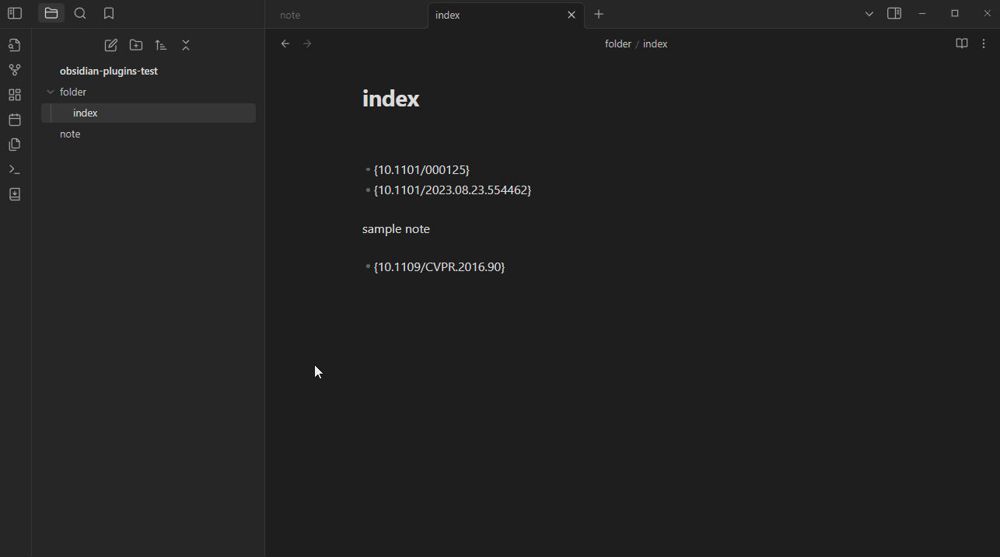

# Obsidian AutoLiterature

Obsidian plugin designed to assist you in taking notes for your literature. Adapted from this [repository](https://github.com/wilmerwang/autoLiterature).

这是一个 Obsidian 插件帮助你记录文献笔记。改编自 [repository](https://github.com/wilmerwang/autoLiterature).

Welcome any suggestions.

## How to use

This plugin has not been included in the official list yet, so it needs to be cloned locally for usage.

- clone this repo to the path: vault/.obsidian
- turn on community plugins in obsidian
- enable autoLiterature

## ScreenShot

This plugin supports arXiv IDs，bio，medRXiv，BioRXiv.

This plugin will Auto-detection the string "- {xxx}".

When the note file includes "- {paper_id}", the information of that literature will be downloaded.

